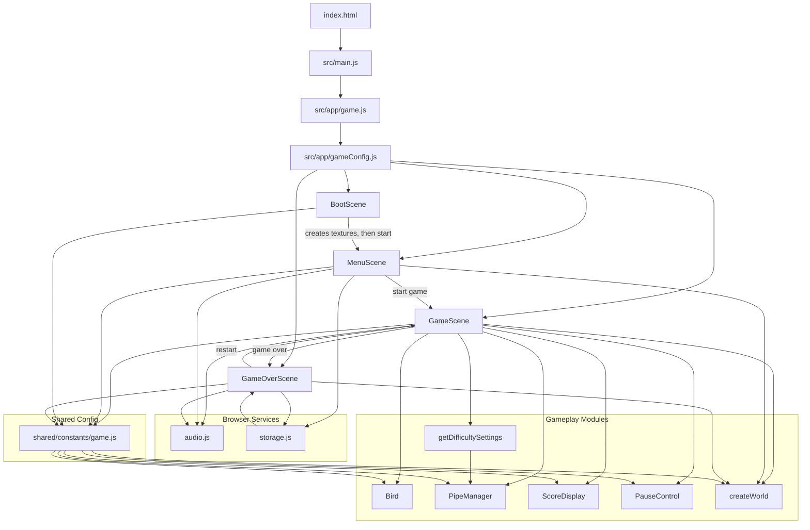

# Architecture Diagram

This diagram shows how the Phaser app is bootstrapped, how scenes transition, and how gameplay modules collaborate during a run.

## Module Roles

### App Bootstrap

- `src/main.js`: browser entry point
- `src/app/game.js`: creates a single Phaser game instance
- `src/app/gameConfig.js`: registers scenes and engine config

### Scenes

- `BootScene`: prepares generated textures and forwards to the menu
- `MenuScene`: start screen and entry into gameplay
- `GameScene`: main loop, input, collisions, scoring, pause, and difficulty
- `GameOverScene`: score summary, best-score display, and restart flow

### Features

- `Bird`: player movement, tilt, and collision helper bounds
- `PipeManager`: pipe spawning, speed updates, collision assistance, and pause support
- `ScoreDisplay`: HUD score card and animation
- `PauseControl`: pause button and paused overlay
- `getDifficultySettings`: score-based tuning progression
- `createWorld`: layered environment art and animated ground/cloud motion

### Services

- `audio.js`: procedural SFX through Web Audio
- `storage.js`: best-score persistence via `localStorage`

### Shared Constants

- `shared/constants/game.js`: scene keys, physics values, dimensions, and difficulty tuning constants

